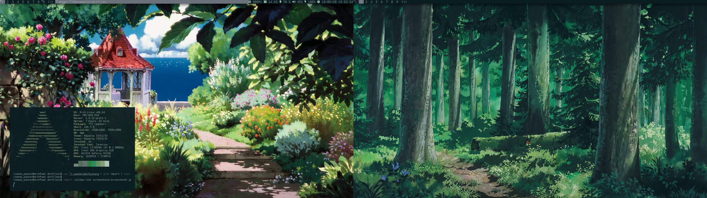

# dotfiles

- .config 
  - gtk-{2..4}.0 --> gtk
  - [Deprecated] i3 --> config file, wallpapers and bar
  - [Deprecated] kitty --> config file 
	- dwm (patches -> autostart, ru_gaps; Coloscheme with pywal)
	- st (patches -> focus, hidecursor, scrollback, vertcenter; Coloscheme with pywal)
  - ranger --> config file
  - scripts --> filter automation in download folder
- [Deprecated] .oh-my-zsh 
- .zshrc --> zsh and alias
- .xkindkey --> mouse buttons shortcuts  
- dunst --> notify-send (pending of configuration)

